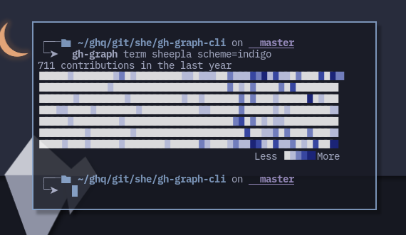

# 🟩 gh-graph-cli

a wrapper command for [kawarimidoll/deno-github-contributions-api](https://github.com/kawarimidoll/deno-github-contributions-api)



## Usage

```
gh-graph -- a github-contribution-api wrapper command

USAGE
    gh-graph MODE USERNAME PARAMS...
    gh-graph --help|--version

    * MODE: output mode
        t, term
        j, json
        x, text
        s, svg
    * USERNAME: username on GitHub
    * PARAMS: 
        parameters for the API 
        syntax is
            name1=value1 name2=value2 ...
        to know parameters, run
            curl https://github-contributions-api.deno.dev/{{USERNAME}}

EXAMPLES
    gh-graph term sheepla scheme=random
    gh-graph json sheepla flat=true

THANKS
    This tool utilises this API. Thanks!
    https://github.com/kawarimidoll/deno-github-contributions-api
```

## Installation

Requires `curl`

Just download and add executable permission

```bash
curl -O https://raw.githubusercontent.com/sheepla/gh-graph-cli/master/gh-graph && chmod +x gh-graph
```

## Thanks

This command utilises this API. Thanks!✨

-  [kawarimidoll/deno-github-contributions-api](https://github.com/kawarimidoll/deno-github-contributions-api)

## TODO

- Add options for API parameters

